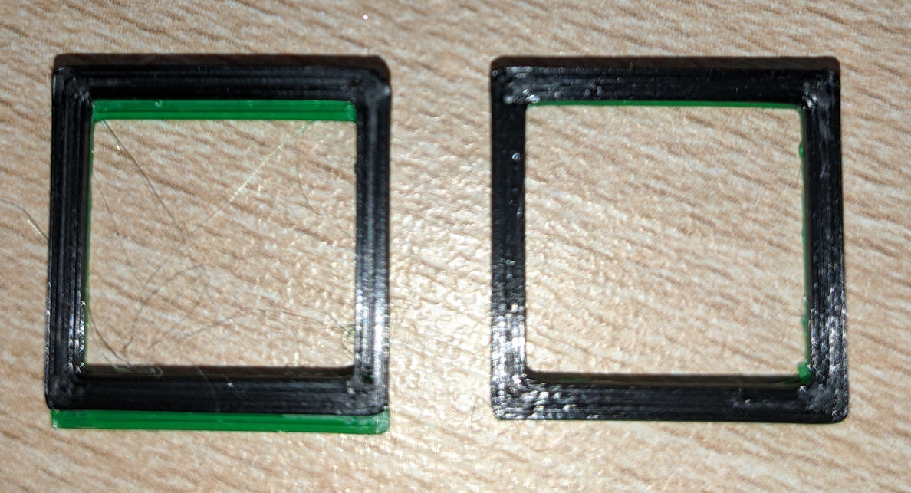

# Prusa Layer Shift on manual filament change (M600) Fix
A fix for layer shifting after manual filament change (M600) on Prusa MK3S printers.

Left: original sliced model; right: after running shiftfix on the same gcode file. Please ignore the stringing :)

I found that whenever I manually change filaments during a print for multi-colored prints, the second part always gets shifted in Y-direction by ~1mm (left in the photo) using PrusaSlicer 2.6.1, MK3S firmware 3.11.0 and Octoprint 1.9.3.

I created a Python script that searches the G-Code for the first occurrence of `M600` (manual filament change), reduces every Y-value starting from there by 1, and saves the result as a new G-Code file. This results in the print running as expected (right in the photo).

I did NOT check yet if/what happens on multiple filament changes.

The error is NOT caused by moving any part of the printer or the printer being misadjusted:
- The same print without filament change does not shift layers and looks perfect.
- During changing filament, I didn't touch anything except for the filament itself. Not the bed, not the head (the latter wouldn't explain a Y-axis shift anyway).
- This happens on all kinds of objects. Downloaded STL files, self-made test objects, doesn't matter.

# Usage

Export the G-Code file, then run 

`python shiftfix.py "your_file.gcode"`

which results in `"your_file_shiftfixed.gcode"`. Send this file to the printer or save on SD.

You can also place the script on the Raspberry Pi directly and run it in a shell there after uploading your gcode from PrusaSlicer.

Since I have no idea about coding, if someone else wants to put this into an Octoprint plugin that can run the script on selected files, go for it and please let me know :)
